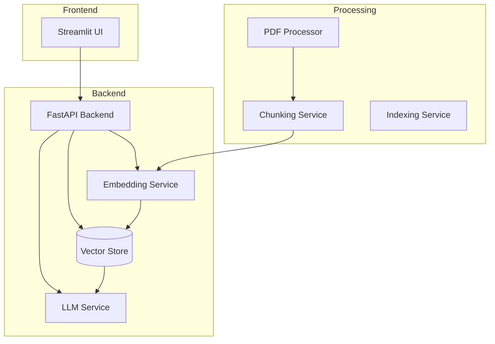
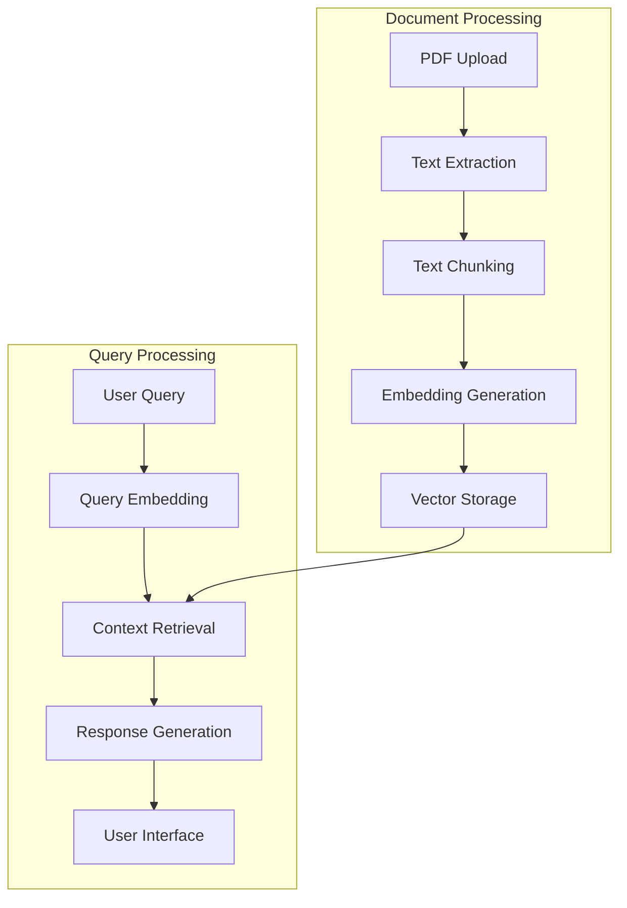

# PDF Chatbot - AI-Powered Document Q&A System

## Key Features
- PDF Document Processing
  - Multi-document support
  - Automatic text extraction and chunking
- Intelligent Question Answering
  - Context-aware responses using RAG
  - Chat history consideration

## Architecture Diagram



## Technical Stack
- **Backend Framework**: FastAPI
- **Frontend**: Streamlit
- **Language Model**: TinyLlama/TinyLlama-1.1B-Chat-v1.0
- **Embedding Model**: all-MiniLM-L6-v2
- **Vector Store**: Qdrant
- **RAG Framework**: LangChain

## Setup Instructions

### Installation

1. Clone the repository
```bash
git clone https://github.com/your-repo/pdf-chatbot.git
cd pdf-chatbot
```

2. Create virtual environment
```bash
python -m venv venv
source venv/bin/activate  # Linux/Mac
```

3. Install dependencies
```bash
pip install -r requirements.txt
```

### Running the Application

#### Development Mode
```bash
# Start backend
python main.py

# Start frontend (in new terminal)
streamlit run src/ui/streamlit_app.py
```

#### Docker Deployment
```bash
docker compose up -d
```

## API Documentation

### Document Management

#### Upload Document
```http
POST /documents/upload
Content-Type: multipart/form-data

file: binary
```

Response:
```json
{
    "status": "success",
    "document_id": "uuid",
    "message": "Document processed successfully"
}
```

#### Chat Interaction
```http
POST /chat
Content-Type: application/json

{
    "session_id": "string",
    "query": "string",
    "document_id": "string"
}
```

Response:
```json
{
    "response": "string",
    "session_id": "string",
    "context_chunks": ["string"]
}
```

## System Architecture


